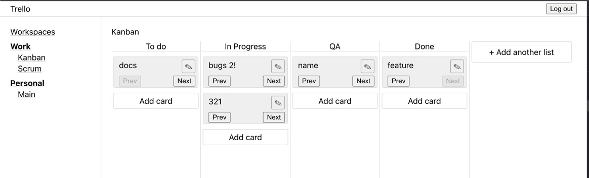

# How to run

`npm install`

`npm run start`

# User journey

1. Create new user
2. Create workspace
3. Create new board
4. Add some lists
5. Add some cards

# UX Features
- Multiple workspaces
- Multiple boards
- Multiple lists
- Navigation between workspaces and boards via sidebar
- URL navigation
- You can change names of lists
- You can change names of cards
- You can move cards between lists
- All data is stored in the localStorage

# NPM packages
- Create react app
- TS

Manually added:
- prettier
- react-router-dom
- sass
- uuid

# Project structure

My goal was to build a prototype of trello with the possibility of further scaling of the application.

* ```/app```
  Initializing the application and creating context
* ```/components``` Simple reusable components. in the future, we can put it in the ui library
* ```/features``` Large parts are projects that can be moved to separate `apps/npm packages` in the future as part of a `micro frontend`. 
Each directory has an `adapter` as middleware that can interact with the context and receive data. The other components can only work with the transmitted props
* ```/layouts``` Different layouts that can be used depending on the screen size and the user's device type
* ```/pages``` Pages use layouts. we can dynamically manage the entities that are used on the page
* ```/routes``` Just react routes
* ```/store``` Context-based `store` that uses `Pub-Sub` design pattern and prevents rerender of the entire component tree when values change. Also saves data to the `localStorage`
* ```/types``` Basic types
